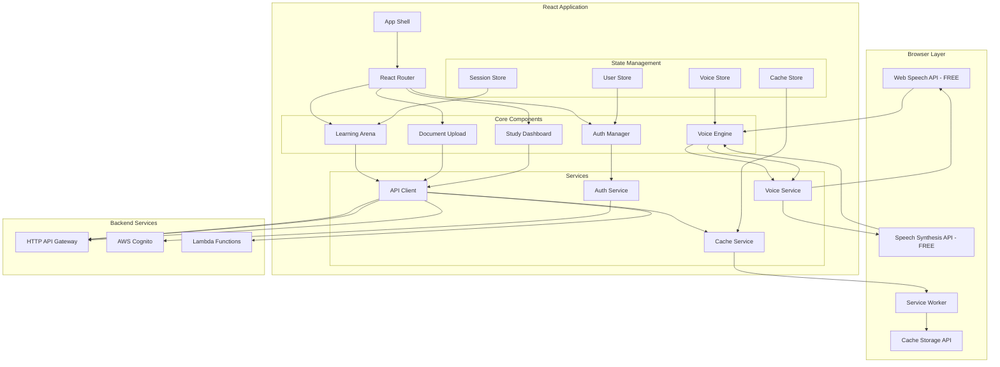

# Design Document: React PWA Frontend for Voice-First AI Learning Assistant

## Overview

The React Progressive Web App (PWA) Frontend is a lightweight, mobile-first client application that implements the ultra-low-cost architecture for the Voice-First AI Learning Assistant. By leveraging browser-native APIs for voice processing, the frontend eliminates $2,640/month in AWS Transcribe/Polly costs while providing a seamless, distraction-free learning experience.

**Key Design Principles:**
- **Browser-First**: Use Web Speech API for zero-cost voice processing
- **Offline-Capable**: Service Workers enable offline learning and caching
- **Mobile-Optimized**: Touch-friendly, responsive design for budget smartphones
- **Bandwidth-Conscious**: Aggressive caching and lazy loading for 3G networks
- **Progressive Enhancement**: Core features work everywhere, enhanced features where supported

**Technology Stack:**
- **Build Tool**: Vite (fast builds, excellent PWA support)
- **Framework**: React 18 with TypeScript
- **State Management**: Zustand (lightweight, 1KB)
- **Routing**: React Router v6
- **HTTP Client**: Axios with interceptors
- **PWA**: vite-plugin-pwa with Workbox
- **Auth**: AWS Amplify Auth module only (minimal bundle size)
- **Styling**: Tailwind CSS (utility-first, tree-shakeable)

**Bundle Size Target**: < 200KB gzipped (critical for 3G networks)

## Architecture

### High-Level Component Architecture



### Data Flow Architecture

**Voice Input Flow (Zero-Cost):**
1. User clicks microphone → Voice Engine activates Web Speech API
2. Browser transcribes speech → Real-time interim results displayed
3. Final transcript → Sent to API Gateway via API Client
4. Response received → Speech Synthesis API reads aloud
5. All processing happens client-side (FREE)

**Document Upload Flow:**
1. User drags file → Upload component validates format/size
2. Request pre-signed S3 URL from API Gateway
3. Upload directly to S3 with progress tracking
4. Backend processes document → User notified via polling/WebSocket

**Offline Flow:**
1. Service Worker intercepts API requests
2. If online → Forward to API, cache response
3. If offline → Return cached response or queue request
4. When online → Sync queued requests automatically

## Components and Interfaces

### 1. Voice Engine Component (Browser-Based)

**Purpose**: Manages all voice interactions using browser-native APIs (zero AWS costs)

**Key Responsibilities:**
- Speech recognition using Web Speech API
- Text-to-speech using Speech Synthesis API
- Language detection and switching
- Fallback to text input for unsupported browsers
- Voice preference persistence

**Interfaces:**
```typescript
interface VoiceEngine {
  // Speech Recognition
  startListening(language: LanguageCode): Promise<void>
  stopListening(): void
  isListening(): boolean
  
  // Speech Synthesis
  speak(text: string, options?: SpeechOptions): Promise<void>
  stopSpeaking(): void
  pauseSpeaking(): void
  resumeSpeaking(): void
  isSpeaking(): boolean
  
  // Configuration
  setLanguage(language: LanguageCode): void
  getAvailableVoices(): SpeechSynthesisVoice[]
  setVoice(voiceURI: string): void
  
  // Feature Detection
  isSpeechRecognitionSupported(): boolean
  isSpeechSynthesisSupported(): boolean
}

interface SpeechOptions {
  language: LanguageCode
  voice?: string
  rate?: number // 0.1 to 10
  pitch?: number // 0 to 2
  volume?: number // 0 to 1
}

interface TranscriptResult {
  transcript: string
  isFinal: boolean
  confidence: number
}

type LanguageCode = 'en-IN' | 'hi-IN' | 'en-US'

// Implementation
class BrowserVoiceEngine implements VoiceEngine {
  private recognition: SpeechRecognition | null
  private synthesis: SpeechSynthesis
  private currentUtterance: SpeechSynthesisUtterance | null
  private onTranscriptCallback?: (result: TranscriptResult) => void
  
  constructor() {
    // Initialize Web Speech API
    this.recognition = this.initializeSpeechRecognition()
    this.synthesis = window.speechSynthesis
  }
  
  private initializeSpeechRecognition(): SpeechRecognition | null {
    const SpeechRecognition = window.SpeechRecognition || window.webkitSpeechRecognition
    if (!SpeechRecognition) return null
    
    const recognition = new SpeechRecognition()
    recognition.continuous = true
    recognition.interimResults = true
    recognition.maxAlternatives = 1
    
    recognition.onresult = (event) => {
      const result = event.results[event.results.length - 1]
      const transcript = result[0].transcript
      const isFinal = result.isFinal
      const confidence = result[0].confidence
      
      this.onTranscriptCallback?.({ transcript, isFinal, confidence })
    }
    
    return recognition
  }
  
  async startListening(language: LanguageCode): Promise<void> {
    if (!this.recognition) {
      throw new Error('Speech recognition not supported')
    }
    
    this.recognition.lang = language
    this.recognition.start()
  }
  
  async speak(text: string, options?: SpeechOptions): Promise<void> {
    return new Promise((resolve, reject) => {
      if (!this.synthesis) {
        reject(new Error('Speech synthesis not supported'))
        return
      }
      
      const utterance = new SpeechSynthesisUtterance(text)
      utterance.lang = options?.language || 'en-IN'
      utterance.rate = options?.rate || 1
      utterance.pitch = options?.pitch || 1
      utterance.volume = options?.volume || 1
      
      if (options?.voice) {
        const voice = this.synthesis.getVoices().find(v => v.voiceURI === options.voice)
        if (voice) utterance.voice = voice
      }
      
      utterance.onend = () => resolve()
      utterance.onerror = (error) => reject(error)
      
      this.currentUtterance = utterance
      this.synthesis.speak(utterance)
    })
  }
  
  isSpeechRecognitionSupported(): boolean {
    return !!this.recognition
  }
  
  isSpeechSynthesisSupported(): boolean {
    return !!this.synthesis
  }
}
```


### 2. Auth Manager Component

**Purpose**: Handles user authentication with AWS Cognito

**Key Responsibilities:**
- User signup and login
- JWT token management and refresh
- Session persistence
- Secure credential storage

**Interfaces:**
```typescript
interface AuthManager {
  // Authentication
  signUp(email: string, password: string, attributes?: UserAttributes): Promise<SignUpResult>
  signIn(email: string, password: string): Promise<SignInResult>
  signOut(): Promise<void>
  
  // Token Management
  getCurrentUser(): Promise<CognitoUser | null>
  getAccessToken(): Promise<string | null>
  refreshToken(): Promise<string>
  
  // Session
  isAuthenticated(): Promise<boolean>
  onAuthStateChange(callback: (user: CognitoUser | null) => void): () => void
}

interface SignUpResult {
  user: CognitoUser
  userConfirmed: boolean
  userSub: string
}

interface SignInResult {
  user: CognitoUser
  accessToken: string
  idToken: string
  refreshToken: string
}

interface UserAttributes {
  name?: string
  preferredLanguage?: string
  [key: string]: string | undefined
}

// Implementation using AWS Amplify Auth
class CognitoAuthManager implements AuthManager {
  async signIn(email: string, password: string): Promise<SignInResult> {
    const { user, tokens } = await Auth.signIn({ username: email, password })
    return {
      user,
      accessToken: tokens.accessToken.toString(),
      idToken: tokens.idToken.toString(),
      refreshToken: tokens.refreshToken.toString()
    }
  }
  
  async getAccessToken(): Promise<string | null> {
    try {
      const session = await Auth.fetchAuthSession()
      return session.tokens?.accessToken.toString() || null
    } catch {
      return null
    }
  }
  
  async refreshToken(): Promise<string> {
    const session = await Auth.fetchAuthSession({ forceRefresh: true })
    return session.tokens!.accessToken.toString()
  }
}
```

### 3. API Client Service

**Purpose**: Manages all HTTP communication with backend services

**Key Responsibilities:**
- HTTP request/response handling
- Authentication header injection
- Request/response caching
- Error handling and retry logic
- Offline request queueing

**Interfaces:**
```typescript
interface APIClient {
  // HTTP Methods
  get<T>(url: string, config?: RequestConfig): Promise<APIResponse<T>>
  post<T>(url: string, data?: any, config?: RequestConfig): Promise<APIResponse<T>>
  put<T>(url: string, data?: any, config?: RequestConfig): Promise<APIResponse<T>>
  delete<T>(url: string, config?: RequestConfig): Promise<APIResponse<T>>
  
  // Configuration
  setBaseURL(url: string): void
  setAuthToken(token: string): void
  clearAuthToken(): void
  
  // Caching
  enableCache(ttl?: number): void
  disableCache(): void
  clearCache(): Promise<void>
}

interface RequestConfig {
  headers?: Record<string, string>
  params?: Record<string, any>
  timeout?: number
  cache?: boolean
  retry?: RetryConfig
}

interface RetryConfig {
  maxRetries: number
  retryDelay: number
  retryCondition?: (error: any) => boolean
}

interface APIResponse<T> {
  data: T
  status: number
  headers: Record<string, string>
  cached: boolean
}

// Implementation with Axios
class AxiosAPIClient implements APIClient {
  private client: AxiosInstance
  private cacheService: CacheService
  
  constructor(baseURL: string, cacheService: CacheService) {
    this.client = axios.create({
      baseURL,
      timeout: 30000,
      headers: {
        'Content-Type': 'application/json'
      }
    })
    
    this.cacheService = cacheService
    this.setupInterceptors()
  }
  
  private setupInterceptors(): void {
    // Request interceptor - add auth token
    this.client.interceptors.request.use(async (config) => {
      const token = await this.getAuthToken()
      if (token) {
        config.headers.Authorization = `Bearer ${token}`
      }
      return config
    })
    
    // Response interceptor - cache responses
    this.client.interceptors.response.use(
      async (response) => {
        if (response.config.method === 'get') {
          await this.cacheService.set(response.config.url!, response.data)
        }
        return response
      },
      async (error) => {
        // Try cache on network error
        if (!navigator.onLine && error.config.method === 'get') {
          const cached = await this.cacheService.get(error.config.url!)
          if (cached) {
            return { data: cached, cached: true }
          }
        }
        throw error
      }
    )
  }
  
  async get<T>(url: string, config?: RequestConfig): Promise<APIResponse<T>> {
    // Check cache first if enabled
    if (config?.cache !== false) {
      const cached = await this.cacheService.get(url)
      if (cached) {
        return { data: cached, status: 200, headers: {}, cached: true }
      }
    }
    
    const response = await this.client.get<T>(url, config)
    return { ...response, cached: false }
  }
}
```

### 4. Cache Service

**Purpose**: Manages client-side caching for offline support and bandwidth optimization

**Key Responsibilities:**
- Cache API responses with TTL
- Offline request queueing
- Cache invalidation
- Storage quota management

**Interfaces:**
```typescript
interface CacheService {
  // Cache Operations
  get(key: string): Promise<any | null>
  set(key: string, value: any, ttl?: number): Promise<void>
  delete(key: string): Promise<void>
  clear(): Promise<void>
  
  // Offline Queue
  queueRequest(request: QueuedRequest): Promise<void>
  getQueuedRequests(): Promise<QueuedRequest[]>
  processQueue(): Promise<void>
  
  // Storage Management
  getStorageUsage(): Promise<StorageEstimate>
  evictOldest(): Promise<void>
}

interface QueuedRequest {
  id: string
  method: string
  url: string
  data?: any
  timestamp: number
  retries: number
}

interface StorageEstimate {
  usage: number
  quota: number
  percentUsed: number
}

// Implementation using Cache API and IndexedDB
class BrowserCacheService implements CacheService {
  private cache: Cache | null = null
  private dbName = 'learning-assistant-cache'
  
  async init(): Promise<void> {
    this.cache = await caches.open('api-cache-v1')
  }
  
  async get(key: string): Promise<any | null> {
    if (!this.cache) await this.init()
    
    const response = await this.cache!.match(key)
    if (!response) return null
    
    const data = await response.json()
    
    // Check TTL
    if (data.expiresAt && Date.now() > data.expiresAt) {
      await this.delete(key)
      return null
    }
    
    return data.value
  }
  
  async set(key: string, value: any, ttl: number = 86400000): Promise<void> {
    if (!this.cache) await this.init()
    
    const data = {
      value,
      expiresAt: Date.now() + ttl
    }
    
    const response = new Response(JSON.stringify(data))
    await this.cache!.put(key, response)
  }
  
  async queueRequest(request: QueuedRequest): Promise<void> {
    // Store in IndexedDB for persistence
    const db = await this.openDB()
    const tx = db.transaction('queue', 'readwrite')
    await tx.objectStore('queue').add(request)
  }
  
  async processQueue(): Promise<void> {
    if (!navigator.onLine) return
    
    const requests = await this.getQueuedRequests()
    for (const request of requests) {
      try {
        await fetch(request.url, {
          method: request.method,
          body: request.data ? JSON.stringify(request.data) : undefined
        })
        await this.removeFromQueue(request.id)
      } catch (error) {
        // Retry later
      }
    }
  }
}
```


### 5. Learning Arena Component (Chat Interface)

**Purpose**: Main chat interface for AI interactions

**Key Responsibilities:**
- Display conversation thread
- Handle user input (text and voice)
- Show typing indicators
- Display mode-specific UI
- Infinite scroll with lazy loading

**Interfaces:**
```typescript
interface LearningArena {
  // Message Management
  sendMessage(content: string, type: MessageType): Promise<void>
  loadMessages(limit?: number, offset?: number): Promise<Message[]>
  clearConversation(): Promise<void>
  
  // Mode Management
  setMode(mode: InteractionMode): void
  getMode(): InteractionMode
  
  // UI State
  setTypingIndicator(visible: boolean): void
  scrollToBottom(): void
}

interface Message {
  id: string
  content: string
  type: MessageType
  mode: InteractionMode
  timestamp: Date
  sender: 'user' | 'assistant'
  metadata?: MessageMetadata
}

interface MessageMetadata {
  sources?: ContentSource[]
  confidence?: number
  cached?: boolean
}

type MessageType = 'text' | 'voice' | 'system'
type InteractionMode = 'tutor' | 'interviewer' | 'mentor'

// React Component
const LearningArena: React.FC = () => {
  const [messages, setMessages] = useState<Message[]>([])
  const [isTyping, setIsTyping] = useState(false)
  const [mode, setMode] = useState<InteractionMode>('tutor')
  const { sendMessage: sendToAPI } = useAPIClient()
  const { speak } = useVoiceEngine()
  
  const handleSendMessage = async (content: string) => {
    // Add user message
    const userMessage: Message = {
      id: generateId(),
      content,
      type: 'text',
      mode,
      timestamp: new Date(),
      sender: 'user'
    }
    setMessages(prev => [...prev, userMessage])
    
    // Show typing indicator
    setIsTyping(true)
    
    try {
      // Send to backend
      const response = await sendToAPI('/chat', {
        message: content,
        mode,
        sessionId: getSessionId()
      })
      
      // Add assistant message
      const assistantMessage: Message = {
        id: generateId(),
        content: response.data.text,
        type: 'text',
        mode,
        timestamp: new Date(),
        sender: 'assistant',
        metadata: {
          sources: response.data.sources,
          confidence: response.data.confidence,
          cached: response.cached
        }
      }
      setMessages(prev => [...prev, assistantMessage])
      
      // Speak response if voice enabled
      if (voiceEnabled) {
        await speak(response.data.text)
      }
    } catch (error) {
      // Handle error
    } finally {
      setIsTyping(false)
    }
  }
  
  return (
    <div className="learning-arena">
      <ModeSelector mode={mode} onModeChange={setMode} />
      <MessageList messages={messages} />
      {isTyping && <TypingIndicator />}
      <MessageInput onSend={handleSendMessage} />
    </div>
  )
}
```

### 6. Document Upload Component

**Purpose**: Handles document upload with progress tracking

**Key Responsibilities:**
- Drag-and-drop file upload
- File validation
- Progress tracking
- Error handling

**Interfaces:**
```typescript
interface DocumentUpload {
  // Upload Operations
  uploadFile(file: File): Promise<UploadResult>
  cancelUpload(uploadId: string): void
  
  // Validation
  validateFile(file: File): ValidationResult
  getSupportedFormats(): string[]
  
  // Progress Tracking
  onProgress(callback: (progress: UploadProgress) => void): void
}

interface UploadResult {
  documentId: string
  fileName: string
  fileSize: number
  status: 'success' | 'error'
  error?: string
}

interface ValidationResult {
  valid: boolean
  errors: string[]
}

interface UploadProgress {
  uploadId: string
  fileName: string
  bytesUploaded: number
  totalBytes: number
  percentage: number
  estimatedTimeRemaining: number
}

// React Component
const DocumentUploadCenter: React.FC = () => {
  const [uploads, setUploads] = useState<Map<string, UploadProgress>>(new Map())
  const { uploadDocument } = useAPIClient()
  
  const handleFileDrop = async (files: FileList) => {
    for (const file of Array.from(files)) {
      // Validate file
      const validation = validateFile(file)
      if (!validation.valid) {
        showError(validation.errors.join(', '))
        continue
      }
      
      // Create upload progress entry
      const uploadId = generateId()
      setUploads(prev => new Map(prev).set(uploadId, {
        uploadId,
        fileName: file.name,
        bytesUploaded: 0,
        totalBytes: file.size,
        percentage: 0,
        estimatedTimeRemaining: 0
      }))
      
      try {
        // Get pre-signed URL
        const { url, documentId } = await uploadDocument.getPresignedUrl(file.name)
        
        // Upload to S3 with progress tracking
        await uploadToS3(url, file, (progress) => {
          setUploads(prev => new Map(prev).set(uploadId, {
            ...prev.get(uploadId)!,
            bytesUploaded: progress.loaded,
            percentage: (progress.loaded / progress.total) * 100,
            estimatedTimeRemaining: calculateETA(progress)
          }))
        })
        
        // Notify backend of completion
        await uploadDocument.notifyComplete(documentId)
        
        // Remove from uploads
        setUploads(prev => {
          const next = new Map(prev)
          next.delete(uploadId)
          return next
        })
        
        showSuccess(`${file.name} uploaded successfully`)
      } catch (error) {
        showError(`Failed to upload ${file.name}`)
      }
    }
  }
  
  return (
    <div 
      className="upload-center"
      onDrop={handleFileDrop}
      onDragOver={(e) => e.preventDefault()}
    >
      <UploadZone />
      <UploadProgressList uploads={Array.from(uploads.values())} />
    </div>
  )
}

const validateFile = (file: File): ValidationResult => {
  const errors: string[] = []
  const supportedFormats = ['.pdf', '.doc', '.docx', '.txt', '.jpg', '.png']
  const maxSize = 50 * 1024 * 1024 // 50MB
  
  const extension = file.name.substring(file.name.lastIndexOf('.')).toLowerCase()
  if (!supportedFormats.includes(extension)) {
    errors.push(`Unsupported format. Supported: ${supportedFormats.join(', ')}`)
  }
  
  if (file.size > maxSize) {
    errors.push(`File too large. Maximum size: 50MB`)
  }
  
  return {
    valid: errors.length === 0,
    errors
  }
}
```


### 7. Study Dashboard Component

**Purpose**: Displays learning progress and study plans

**Key Responsibilities:**
- Show daily progress
- Display study plan
- Track goal completion
- Provide motivational feedback

**Interfaces:**
```typescript
interface StudyDashboard {
  // Data Fetching
  loadProgress(): Promise<ProgressData>
  loadStudyPlan(): Promise<StudyPlan | null>
  
  // Progress Updates
  updateTopicProgress(topicId: string, status: CompletionStatus): Promise<void>
  
  // Plan Management
  createStudyPlan(goal: StudyGoal): Promise<StudyPlan>
  modifyStudyPlan(planId: string, changes: PlanChanges): Promise<StudyPlan>
}

interface ProgressData {
  userId: string
  totalSessions: number
  completedTopics: number
  totalTopics: number
  currentStreak: number
  longestStreak: number
  weeklyProgress: DailyProgress[]
}

interface DailyProgress {
  date: Date
  sessionsCompleted: number
  minutesStudied: number
  topicsCompleted: string[]
}

interface StudyPlan {
  planId: string
  goal: StudyGoal
  dailySessions: DailySession[]
  startDate: Date
  endDate: Date
  progress: number
}

interface DailySession {
  date: Date
  topics: string[]
  estimatedMinutes: number
  completed: boolean
}

// React Component
const StudyDashboard: React.FC = () => {
  const [progress, setProgress] = useState<ProgressData | null>(null)
  const [studyPlan, setStudyPlan] = useState<StudyPlan | null>(null)
  const { getProgress, getStudyPlan } = useAPIClient()
  
  useEffect(() => {
    loadDashboardData()
  }, [])
  
  const loadDashboardData = async () => {
    const [progressData, planData] = await Promise.all([
      getProgress(),
      getStudyPlan()
    ])
    setProgress(progressData)
    setStudyPlan(planData)
  }
  
  return (
    <div className="study-dashboard">
      <ProgressOverview progress={progress} />
      <StreakDisplay streak={progress?.currentStreak || 0} />
      <WeeklyChart data={progress?.weeklyProgress || []} />
      {studyPlan ? (
        <StudyPlanView plan={studyPlan} />
      ) : (
        <CreatePlanPrompt />
      )}
    </div>
  )
}
```

## Data Models

### User State
```typescript
interface UserState {
  user: CognitoUser | null
  profile: UserProfile | null
  isAuthenticated: boolean
  isLoading: boolean
}

interface UserProfile {
  userId: string
  email: string
  name: string
  preferredLanguage: LanguageCode
  voiceEnabled: boolean
  selectedVoice?: string
  createdAt: Date
  lastActive: Date
}
```

### Session State
```typescript
interface SessionState {
  sessionId: string
  mode: InteractionMode
  messages: Message[]
  isTyping: boolean
  context: ConversationContext
}

interface ConversationContext {
  currentTopic?: string
  recentQueries: string[]
  relevantDocuments: string[]
}
```

### Voice State
```typescript
interface VoiceState {
  isListening: boolean
  isSpeaking: boolean
  language: LanguageCode
  selectedVoice?: string
  interimTranscript: string
  finalTranscript: string
  error?: string
}
```

### Cache State
```typescript
interface CacheState {
  isOnline: boolean
  queuedRequests: QueuedRequest[]
  storageUsage: StorageEstimate
  lastSync: Date
}
```

## State Management with Zustand

```typescript
// User Store
const useUserStore = create<UserState & UserActions>((set) => ({
  user: null,
  profile: null,
  isAuthenticated: false,
  isLoading: true,
  
  setUser: (user) => set({ user, isAuthenticated: !!user }),
  setProfile: (profile) => set({ profile }),
  logout: () => set({ user: null, profile: null, isAuthenticated: false })
}))

// Session Store
const useSessionStore = create<SessionState & SessionActions>((set) => ({
  sessionId: generateSessionId(),
  mode: 'tutor',
  messages: [],
  isTyping: false,
  context: { recentQueries: [], relevantDocuments: [] },
  
  addMessage: (message) => set((state) => ({
    messages: [...state.messages, message]
  })),
  setMode: (mode) => set({ mode }),
  setTyping: (isTyping) => set({ isTyping }),
  clearMessages: () => set({ messages: [] })
}))

// Voice Store
const useVoiceStore = create<VoiceState & VoiceActions>((set) => ({
  isListening: false,
  isSpeaking: false,
  language: 'en-IN',
  interimTranscript: '',
  finalTranscript: '',
  
  setListening: (isListening) => set({ isListening }),
  setSpeaking: (isSpeaking) => set({ isSpeaking }),
  setLanguage: (language) => set({ language }),
  setInterimTranscript: (transcript) => set({ interimTranscript: transcript }),
  setFinalTranscript: (transcript) => set({ finalTranscript: transcript }),
  setError: (error) => set({ error })
}))
```

## PWA Configuration

### Service Worker Strategy

**Workbox Configuration:**
```typescript
// vite.config.ts
import { VitePWA } from 'vite-plugin-pwa'

export default defineConfig({
  plugins: [
    react(),
    VitePWA({
      registerType: 'autoUpdate',
      includeAssets: ['favicon.ico', 'robots.txt', 'apple-touch-icon.png'],
      manifest: {
        name: 'AI Learning Assistant',
        short_name: 'AI Tutor',
        description: 'Voice-first AI learning assistant for students',
        theme_color: '#4F46E5',
        background_color: '#ffffff',
        display: 'standalone',
        orientation: 'portrait',
        icons: [
          {
            src: 'pwa-192x192.png',
            sizes: '192x192',
            type: 'image/png'
          },
          {
            src: 'pwa-512x512.png',
            sizes: '512x512',
            type: 'image/png',
            purpose: 'any maskable'
          }
        ]
      },
      workbox: {
        runtimeCaching: [
          {
            urlPattern: /^https:\/\/api\.learning-assistant\.com\/.*$/,
            handler: 'NetworkFirst',
            options: {
              cacheName: 'api-cache',
              expiration: {
                maxEntries: 100,
                maxAgeSeconds: 86400 // 24 hours
              },
              cacheableResponse: {
                statuses: [0, 200]
              }
            }
          },
          {
            urlPattern: /\.(?:png|jpg|jpeg|svg|gif|webp)$/,
            handler: 'CacheFirst',
            options: {
              cacheName: 'image-cache',
              expiration: {
                maxEntries: 50,
                maxAgeSeconds: 2592000 // 30 days
              }
            }
          }
        ]
      }
    })
  ]
})
```

### Offline Support Strategy

**Network-First for API Calls:**
- Try network request first
- Fall back to cache if offline
- Queue mutations for later sync

**Cache-First for Static Assets:**
- Serve from cache immediately
- Update cache in background

**Background Sync:**
- Queue failed requests
- Retry when connectivity returns
- Notify user of sync status


## Correctness Properties

*A property is a characteristic or behavior that should hold true across all valid executions of a system—essentially, a formal statement about what the system should do. Properties serve as the bridge between human-readable specifications and machine-verifiable correctness guarantees.*

Based on the prework analysis of acceptance criteria, the following properties ensure system correctness:

### Property 1: Offline Content Accessibility
*For any* offline scenario, the PWA should display previously cached conversations and study materials, and queue user actions for synchronization when connectivity returns.
**Validates: Requirements 1.3, 9.1, 9.2**

### Property 2: Network State Adaptation
*For any* network condition change (online/offline), the PWA should adapt functionality appropriately, notify users of the change, and explain available capabilities.
**Validates: Requirements 1.5, 13.2**

### Property 3: Voice Transcription Processing
*For any* speech input when voice recognition is active, the Browser_Voice_Engine should transcribe audio to text with interim results and send the final transcript to the backend API.
**Validates: Requirements 2.2, 2.3**

### Property 4: Voice Error Handling
*For any* voice recognition error, the Browser_Voice_Engine should provide user-friendly error messages, offer retry options, and fall back to text input when necessary.
**Validates: Requirements 2.5, 13.4**

### Property 5: Text-to-Speech Playback
*For any* AI response received when voice output is enabled, the Browser_Voice_Engine should read it aloud using the SpeechSynthesis API with functional playback controls.
**Validates: Requirements 3.1, 3.2**

### Property 6: Language-Appropriate Voice Selection
*For any* language used in responses, the Browser_Voice_Engine should select and use appropriate voices for that language during speech synthesis.
**Validates: Requirements 3.3, 4.4**

### Property 7: Voice Preference Persistence
*For any* voice output toggle, the PWA should remember the user's preference and restore it across sessions.
**Validates: Requirements 3.5**

### Property 8: Language Context Preservation
*For any* language switch, the PWA should update UI and voice settings while preserving conversation context without data loss.
**Validates: Requirements 4.5**

### Property 9: Authentication Token Management
*For any* successful login, the Auth_Manager should obtain JWT tokens, store them securely, and refresh them automatically when they expire without disrupting the user experience.
**Validates: Requirements 5.3, 5.4**

### Property 10: Session Data Cleanup
*For any* logout action, the Auth_Manager should clear all session data, cached credentials, and user-specific information from local storage.
**Validates: Requirements 5.5**

### Property 11: File Upload Validation and Processing
*For any* file dropped in the upload zone, the Document_Upload_Center should validate the format, initiate upload with progress tracking for supported files, or display appropriate error messages for unsupported formats.
**Validates: Requirements 6.2, 6.3, 6.4**

### Property 12: Upload Error Recovery
*For any* upload failure, the Document_Upload_Center should provide retry options and detailed error information to help users resolve the issue.
**Validates: Requirements 6.5**

### Property 13: Message Display Consistency
*For any* message sent or received, the Learning_Arena should display it immediately in the conversation thread with clear visual distinction between user and AI messages.
**Validates: Requirements 7.1, 7.2**

### Property 14: Mode Visual Indication
*For any* active interaction mode (Tutor, Interviewer, Mentor), the Learning_Arena should visually indicate the current mode and display a typing indicator when loading responses.
**Validates: Requirements 7.3, 7.4**

### Property 15: Dashboard Data Display
*For any* dashboard load, the Study_Dashboard should display daily session progress, completion status, and upcoming topics if a study plan exists.
**Validates: Requirements 8.1, 8.2**

### Property 16: Real-Time Progress Updates
*For any* progress update, the Study_Dashboard should reflect changes in real-time without requiring manual refresh.
**Validates: Requirements 8.3**

### Property 17: Offline Message Queueing
*For any* message sent while offline, the Cache_Manager should queue it and automatically synchronize when connectivity is restored.
**Validates: Requirements 9.2, 9.3**

### Property 18: Cache TTL Enforcement
*For any* cached response, the Cache_Manager should implement a 24-hour TTL and automatically remove expired entries.
**Validates: Requirements 9.4**

### Property 19: Cache Eviction Policy
*For any* storage limit reached scenario, the Cache_Manager should remove the oldest cached data first (FIFO eviction).
**Validates: Requirements 9.5**

### Property 20: Responsive Image Sizing
*For any* image displayed, the PWA should use responsive images with appropriate sizes based on the device viewport and pixel density.
**Validates: Requirements 10.2**

### Property 21: API Response Compression
*For any* API response received, the API_Client should use gzip or brotli compression to minimize bandwidth usage.
**Validates: Requirements 10.3**

### Property 22: Low-Bandwidth Mode Optimizations
*For any* time spent in low-bandwidth mode, the PWA should disable auto-playing media and reduce image quality to conserve data.
**Validates: Requirements 10.5**

### Property 23: Responsive Layout Adaptation
*For any* viewport size (mobile or desktop), the PWA should display an appropriate layout optimized for that screen size and adapt smoothly when the device is rotated without losing state.
**Validates: Requirements 11.1, 11.2, 11.3**

### Property 24: Touch Gesture Support
*For any* touch gesture used (swipe, pinch, tap), the PWA should respond appropriately with the expected interaction.
**Validates: Requirements 11.4**

### Property 25: Keyboard Viewport Adjustment
*For any* input field focused that triggers the keyboard, the PWA should adjust the viewport to keep the input field visible.
**Validates: Requirements 11.5**

### Property 26: Mode Switch Context Preservation
*For any* mode switch, the Learning_Arena should update the interface to reflect the new mode while preserving conversation context and notifying the user.
**Validates: Requirements 12.1, 12.5**

### Property 27: Error Message Clarity
*For any* error that occurs (API, network, authentication, voice), the PWA should display user-friendly error messages with suggested actions or fallback options.
**Validates: Requirements 13.1, 13.2, 13.3, 13.4**

### Property 28: Success Feedback
*For any* successful action, the PWA should provide subtle confirmation feedback without disrupting the user's flow.
**Validates: Requirements 13.5**

### Property 29: Navigation Performance
*For any* navigation between views, the PWA should transition smoothly without visible lag or performance degradation.
**Validates: Requirements 14.2**

### Property 30: Voice Processing Latency
*For any* voice input processed, the Browser_Voice_Engine should minimize latency to provide real-time feedback to the user.
**Validates: Requirements 14.4**

### Property 31: Accessibility Labels
*For any* interactive element, the PWA should provide descriptive labels that are accessible to screen readers.
**Validates: Requirements 15.1**

### Property 32: Keyboard Navigation Support
*For any* keyboard navigation, the PWA should support tab navigation with visible focus indicators on all interactive elements.
**Validates: Requirements 15.2**

### Property 33: Color Contrast Compliance
*For any* text displayed, the PWA should use sufficient color contrast ratios to meet WCAG accessibility standards.
**Validates: Requirements 15.3**

### Property 34: Touch Target Sizing
*For any* interactive element, the PWA should ensure minimum touch target sizes of 44x44 pixels for comfortable mobile interaction.
**Validates: Requirements 15.4**

### Property 35: Reduced Motion Respect
*For any* animation displayed, the PWA should respect user preferences for reduced motion when that preference is enabled.
**Validates: Requirements 15.5**

## Error Handling

### Error Categories and Strategies

**1. Voice Processing Errors**
- **Browser Not Supported**: Display clear message explaining Web Speech API requirement, offer text input fallback
- **Microphone Permission Denied**: Guide user to grant permissions with step-by-step instructions
- **Recognition Errors**: Provide retry button, suggest speaking more clearly, offer text input
- **Synthesis Errors**: Fall back to text-only display, maintain conversation flow

**2. Network Errors**
- **Offline State**: Display offline banner, show cached content, queue actions for sync
- **API Timeouts**: Retry with exponential backoff, show loading state, offer cancel option
- **Rate Limiting**: Display friendly message, suggest waiting, show retry countdown
- **Server Errors**: Show error details, provide retry button, suggest alternative actions

**3. Authentication Errors**
- **Invalid Credentials**: Clear error message, highlight incorrect fields, offer password reset
- **Token Expiration**: Automatic refresh attempt, re-authenticate if refresh fails
- **Session Timeout**: Notify user, preserve unsaved work, redirect to login
- **Permission Denied**: Explain required permissions, guide to appropriate access level

**4. File Upload Errors**
- **Unsupported Format**: List supported formats, suggest conversion tools
- **File Too Large**: Display size limit, suggest compression or splitting
- **Upload Failed**: Provide retry button, show error details, offer alternative upload method
- **Processing Failed**: Notify user, suggest re-upload, provide support contact

**5. Storage Errors**
- **Quota Exceeded**: Offer to clear old cache, show storage usage, guide cleanup
- **IndexedDB Errors**: Fall back to localStorage, notify user of limitations
- **Cache Corruption**: Clear corrupted cache, re-fetch data, notify user

### Error Recovery Patterns

**Graceful Degradation**: Core features work even when enhanced features fail
**Automatic Retry**: Transient errors retry automatically with exponential backoff
**User Notification**: Always inform users of errors with actionable next steps
**Fallback Mechanisms**: Provide alternative ways to accomplish tasks when primary method fails
**State Preservation**: Maintain user progress and context across error scenarios

## Testing Strategy

### Dual Testing Approach

The system requires both unit testing and property-based testing for comprehensive coverage:

**Unit Tests**: Focus on specific examples, edge cases, browser compatibility, and UI interactions
**Property Tests**: Verify universal properties across all possible inputs and states

### Property-Based Testing Configuration

**Testing Framework**: Use fast-check (TypeScript) for property-based testing
**Test Iterations**: Minimum 100 iterations per property test to ensure comprehensive input coverage
**Test Tagging**: Each property test must reference its corresponding design document property

Tag format: **Feature: react-pwa-frontend, Property {number}: {property_text}**

### Testing Coverage Areas

**1. Voice Engine Tests**
- Unit tests for Web Speech API integration and browser compatibility
- Property tests for voice transcription processing (Property 3) and error handling (Property 4)
- Property tests for text-to-speech playback (Property 5) and language selection (Property 6)
- Edge case tests for unsupported browsers
- Integration tests for voice preference persistence (Property 7)

**2. PWA Infrastructure Tests**
- Unit tests for service worker registration and update lifecycle
- Property tests for offline content accessibility (Property 1) and network adaptation (Property 2)
- Property tests for cache TTL enforcement (Property 18) and eviction policy (Property 19)
- Integration tests for background sync and offline queueing (Property 17)

**3. Authentication Tests**
- Unit tests for Cognito integration and token storage
- Property tests for token management (Property 9) and session cleanup (Property 10)
- Integration tests for automatic token refresh
- Security tests for credential storage

**4. File Upload Tests**
- Unit tests for file validation and drag-and-drop
- Property tests for upload validation (Property 11) and error recovery (Property 12)
- Integration tests for S3 pre-signed URL flow
- Performance tests for large file uploads

**5. Chat Interface Tests**
- Unit tests for message rendering and mode switching
- Property tests for message display (Property 13) and mode indication (Property 14)
- Property tests for mode context preservation (Property 26)
- Integration tests for real-time updates

**6. Dashboard Tests**
- Unit tests for progress visualization and plan display
- Property tests for dashboard data display (Property 15) and real-time updates (Property 16)
- Integration tests for API data fetching

**7. Responsive Design Tests**
- Unit tests for breakpoint behavior and touch gestures
- Property tests for responsive layout (Property 23) and touch support (Property 24)
- Property tests for keyboard viewport adjustment (Property 25)
- Cross-browser and cross-device testing

**8. Accessibility Tests**
- Property tests for accessibility labels (Property 31) and keyboard navigation (Property 32)
- Property tests for color contrast (Property 33) and touch targets (Property 34)
- Property tests for reduced motion (Property 35)
- Automated accessibility audits with axe-core

**9. Performance Tests**
- Unit tests for lazy loading and code splitting
- Property tests for navigation performance (Property 29) and voice latency (Property 30)
- Load time testing on throttled 3G networks
- Bundle size monitoring (target: < 200KB gzipped)

**10. Error Handling Tests**
- Property tests for error message clarity (Property 27) and success feedback (Property 28)
- Integration tests for all error recovery patterns
- Chaos testing for network failures and API errors

### Test Data Management

**Mock Services**: Mock Web Speech API, AWS Cognito, and backend APIs for isolated testing
**Test Fixtures**: Create realistic test data for messages, documents, and user profiles
**Browser Mocking**: Use Playwright or Puppeteer for cross-browser testing
**Network Simulation**: Use service worker to simulate offline/slow network conditions

### Continuous Integration

**Pre-commit Hooks**: Run linting and type checking
**Pull Request Checks**: Run all unit tests and property tests
**Nightly Builds**: Run full test suite including performance and accessibility tests
**Deployment Gates**: Require all tests passing and bundle size within limits
