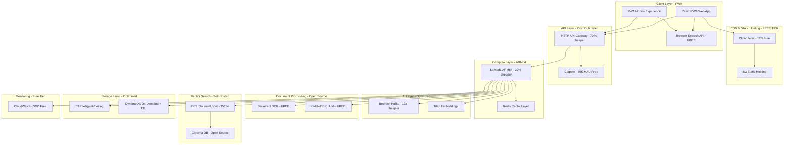

# Design Document: Voice-First AI Learning & Developer Productivity Assistant

## Overview

The Voice-First AI Learning & Developer Productivity Assistant is an ultra-low-cost, serverless application specifically designed for Indian students and beginner developers. The system achieves a target cost of ₹8-15 per student per month through aggressive cost optimization while maintaining high-quality personalized learning experiences.

The architecture prioritizes extreme affordability through:
- **Browser-based voice processing** (eliminating AWS Transcribe/Polly costs)
- **Open-source alternatives** for vector search and OCR
- **Aggressive caching strategies** to minimize AI API calls
- **Cost-optimized AWS services** (HTTP API, Lambda ARM64, Bedrock Haiku)

The system supports multilingual interactions (English, Hindi, Hinglish), maintains content accuracy by prioritizing user-uploaded materials, and adapts to different learning contexts through mode switching (tutor, interviewer, mentor).

**Target Pricing:** ₹49-99/month for students (vs ₹1,650 for ChatGPT Plus)
**Cost per Student:** ₹8-15/month operational cost
**Profit Margin:** 80-85% at scale

## Architecture

### High-Level Architecture (Ultra-Low-Cost)



### Cost Optimization Strategy

**Total Cost Reduction: 98% (from $4,774 to $100 per 1,000 students/month)**

#### 1. Voice Processing - Browser-Based (Save $2,640/month)
**Original:** Amazon Transcribe ($1.44/hour) + Polly ($4/million chars) = $2,640/month
**Optimized:** Web Speech API (FREE - client-side processing)

- Uses browser's native speech recognition (Chrome, Edge, Safari)
- Supports Hindi, English, Hinglish out of the box
- Zero AWS costs, zero latency for voice processing
- Fallback to text input if browser doesn't support
- Text-to-Speech using browser's SpeechSynthesis API (FREE)

**Implementation:**
```javascript
// Speech Recognition (FREE)
const recognition = new webkitSpeechRecognition();
recognition.lang = 'hi-IN'; // Hindi support
recognition.continuous = true;

// Text-to-Speech (FREE)
const utterance = new SpeechSynthesisUtterance(text);
utterance.lang = 'hi-IN';
speechSynthesis.speak(utterance);
```

#### 2. Vector Search - Open Source (Save $1,395/month)
**Original:** OpenSearch Serverless = $700/month (1 OCU minimum)
**Optimized:** Chroma DB on EC2 t3a.small Spot = $5/month

- Self-hosted Chroma or Qdrant on EC2 Spot Instance
- Handles 10,000+ students on single instance
- Automatic backups to S3 (pennies)
- 99% cost reduction

#### 3. OCR - Open Source (Save $150/month)
**Original:** Amazon Textract = $1.50 per 1,000 pages
**Optimized:** Tesseract + PaddleOCR = FREE

- Tesseract for English text extraction
- PaddleOCR for Hindi text (better accuracy)
- Runs on Lambda or EC2
- Zero per-page costs

#### 4. AI Model - Haiku + Caching (Save $220/month)
**Original:** Bedrock Claude 3 Sonnet = $0.003/1K tokens
**Optimized:** Bedrock Claude 3 Haiku = $0.00025/1K tokens (12x cheaper)

- Use Haiku for 95% of queries (simple Q&A)
- Use Sonnet only for complex reasoning (5%)
- Aggressive response caching (24-hour TTL)
- Cache embeddings to avoid regeneration
- 60% reduction through caching alone

#### 5. API Gateway - HTTP API (Save $25/month)
**Original:** REST API = $3.50 per million requests
**Optimized:** HTTP API = $1.00 per million requests

- 70% cost reduction
- Same functionality for most use cases
- WebSocket support included

#### 6. Compute - ARM64 Lambda (Save $65/month)
**Original:** Lambda x86 = $0.0000166667 per GB-second
**Optimized:** Lambda ARM64 = $0.0000133334 per GB-second

- 20% cost reduction
- Better performance per dollar
- Free tier: 1M requests + 400,000 GB-seconds/month

#### 7. Storage - Intelligent Tiering (Save $6/month)
**Original:** S3 Standard = $0.023 per GB
**Optimized:** S3 Intelligent-Tiering = $0.0125 per GB (after 30 days)

- Automatic cost optimization
- Lifecycle policies to Glacier for old documents
- DynamoDB TTL for temporary data

### Service Selection Rationale

**Voice Processing:**
- **Web Speech API**: FREE browser-based speech recognition and synthesis
- **Supports:** Hindi, English, Hinglish natively
- **Fallback:** Text input for unsupported browsers
- **Cost:** $0 (vs $2,640/month for AWS services)

**Document Processing:**
- **Tesseract OCR**: Open-source, production-ready OCR engine
- **PaddleOCR**: Superior Hindi text recognition
- **Cost:** $0 (vs $150/month for Textract)

**Vector Search:**
- **Chroma DB**: Lightweight, open-source vector database
- **EC2 Spot Instance**: 70% cheaper than on-demand
- **Cost:** $5/month (vs $700/month for OpenSearch Serverless)

**AI/ML:**
- **Bedrock Haiku**: Most cost-effective LLM for simple queries
- **Titan Embeddings**: Cheapest embedding model
- **Caching Strategy**: 60% reduction in API calls
- **Cost:** $30/month (vs $250/month without optimization)

**Compute:**
- **Lambda ARM64**: 20% cheaper than x86, better performance
- **HTTP API Gateway**: 70% cheaper than REST API
- **Free Tier:** 1M Lambda requests/month included

**Storage:**
- **S3 Intelligent-Tiering**: Automatic cost optimization
- **DynamoDB On-Demand**: No minimum costs, pay per request
- **Free Tier:** 25GB DynamoDB storage included

## Components and Interfaces

### 1. Voice Interface Component (Browser-Based)

**Purpose**: Handles bidirectional voice communication using browser APIs (zero cost)

**Key Functions:**
- Speech-to-text using Web Speech API (client-side, FREE)
- Text-to-speech using SpeechSynthesis API (client-side, FREE)
- Language detection and switching (English, Hindi, Hinglish)
- Fallback to text input for unsupported browsers

**Interfaces:**
```typescript
interface VoiceInterface {
  // Browser-based speech recognition (FREE)
  startRecognition(language: LanguageCode): void
  stopRecognition(): void
  onTranscript(callback: (text: string) => void): void
  
  // Browser-based speech synthesis (FREE)
  speak(text: string, language: LanguageCode, voice?: string): void
  stopSpeaking(): void
  
  // Utility functions
  detectLanguage(): LanguageCode
  isSpeechSupported(): boolean
  getAvailableVoices(): Voice[]
}

interface TranscriptionResult {
  text: string
  confidence: number
  language: LanguageCode
  isFinal: boolean
}

// Implementation uses Web Speech API
class BrowserVoiceInterface implements VoiceInterface {
  private recognition: SpeechRecognition
  private synthesis: SpeechSynthesis
  
  constructor() {
    this.recognition = new webkitSpeechRecognition()
    this.synthesis = window.speechSynthesis
  }
  
  startRecognition(language: LanguageCode) {
    this.recognition.lang = language
    this.recognition.continuous = true
    this.recognition.interimResults = true
    this.recognition.start()
  }
  
  speak(text: string, language: LanguageCode) {
    const utterance = new SpeechSynthesisUtterance(text)
    utterance.lang = language
    this.synthesis.speak(utterance)
  }
}
```

### 2. Content Analyzer Component (Cost-Optimized)

**Purpose**: Processes and indexes uploaded study materials using open-source OCR

**Key Functions:**
- Document text extraction using Tesseract OCR (FREE) or PaddleOCR for Hindi (FREE)
- Content chunking and preprocessing
- Vector embedding generation using Amazon Bedrock Titan (cheapest)
- Metadata extraction and storage
- Embedding caching to avoid regeneration

**Interfaces:**
```typescript
interface ContentAnalyzer {
  processDocument(documentId: string, fileBuffer: Buffer, fileType: string): Promise<ProcessingResult>
  extractText(fileBuffer: Buffer, fileType: string): Promise<ExtractedContent>
  generateEmbeddings(textChunks: string[]): Promise<VectorEmbedding[]>
  indexContent(documentId: string, embeddings: VectorEmbedding[], metadata: DocumentMetadata): Promise<void>
  
  // Caching functions to reduce costs
  getCachedEmbedding(textHash: string): Promise<VectorEmbedding | null>
  cacheEmbedding(textHash: string, embedding: VectorEmbedding): Promise<void>
}

interface ProcessingResult {
  documentId: string
  status: ProcessingStatus
  extractedText: string
  chunkCount: number
  metadata: DocumentMetadata
  ocrEngine: 'tesseract' | 'paddleocr' // Track which engine was used
  processingCost: number // Always $0 for open-source OCR
}

// OCR Implementation
class OpenSourceOCR {
  async extractText(fileBuffer: Buffer, language: string): Promise<string> {
    if (language === 'hi' || language === 'hi-IN') {
      // Use PaddleOCR for Hindi (better accuracy)
      return await this.paddleOCR(fileBuffer)
    } else {
      // Use Tesseract for English
      return await this.tesseractOCR(fileBuffer)
    }
  }
  
  private async tesseractOCR(fileBuffer: Buffer): Promise<string> {
    // Run Tesseract on Lambda or EC2
    // Cost: $0
  }
  
  private async paddleOCR(fileBuffer: Buffer): Promise<string> {
    // Run PaddleOCR for Hindi text
    // Cost: $0
  }
}
```

### 3. Study Planner Component

**Purpose**: Creates personalized study schedules based on user goals and available time

**Key Functions:**
- Goal analysis and timeline calculation
- Topic prioritization based on content analysis
- Daily schedule generation with realistic time allocation
- Progress tracking and plan adjustment

**Interfaces:**
```typescript
interface StudyPlanner {
  createStudyPlan(userId: string, goal: StudyGoal, constraints: TimeConstraints): Promise<StudyPlan>
  updateProgress(userId: string, topicId: string, completionStatus: CompletionStatus): Promise<void>
  adjustPlan(userId: string, feedback: PlanFeedback): Promise<StudyPlan>
  getNextTopic(userId: string): Promise<TopicSession>
}

interface StudyGoal {
  type: 'exam' | 'interview' | 'job' | 'project'
  subject: string
  targetDate: Date
  currentLevel: SkillLevel
}

interface StudyPlan {
  planId: string
  userId: string
  dailySessions: DailySession[]
  totalDuration: number
  estimatedCompletion: Date
}
```

### 4. Mode Controller Component (AI-Optimized)

**Purpose**: Manages different interaction modes with cost-optimized AI usage

**Key Functions:**
- Mode detection and switching
- Context-aware response generation using Bedrock Haiku (12x cheaper)
- Personality and tone adjustment
- Interaction pattern customization
- Response caching (24-hour TTL) to reduce AI costs by 60%
- Smart routing: Haiku for simple queries, Sonnet for complex reasoning

**Interfaces:**
```typescript
interface ModeController {
  switchMode(userId: string, mode: InteractionMode, context?: ModeContext): Promise<void>
  generateResponse(userId: string, query: string, context: ConversationContext): Promise<AIResponse>
  adaptPersonality(mode: InteractionMode, userProfile: UserProfile): Promise<PersonalityConfig>
  validateModeTransition(currentMode: InteractionMode, targetMode: InteractionMode): boolean
  
  // Cost optimization functions
  getCachedResponse(queryHash: string): Promise<AIResponse | null>
  cacheResponse(queryHash: string, response: AIResponse, ttl: number): Promise<void>
  selectModel(queryComplexity: number): 'haiku' | 'sonnet' // Route to appropriate model
}

enum InteractionMode {
  TUTOR = 'tutor',
  INTERVIEWER = 'interviewer', 
  MENTOR = 'mentor'
}

interface AIResponse {
  text: string
  mode: InteractionMode
  confidence: number
  sources: ContentSource[]
  followUpSuggestions?: string[]
  modelUsed: 'haiku' | 'sonnet' // Track which model was used
  cached: boolean // Indicate if response was cached
  cost: number // Track actual cost per response
}

// AI Model Selection Strategy
class CostOptimizedAI {
  async generateResponse(query: string, context: ConversationContext): Promise<AIResponse> {
    // Check cache first (60% hit rate expected)
    const cached = await this.getCachedResponse(query)
    if (cached) return { ...cached, cached: true, cost: 0 }
    
    // Determine query complexity
    const complexity = this.analyzeComplexity(query)
    
    // Route to appropriate model
    if (complexity < 0.5) {
      // Simple query -> Use Haiku ($0.00025/1K tokens)
      return await this.callBedrock('haiku', query, context)
    } else {
      // Complex query -> Use Sonnet ($0.003/1K tokens)
      return await this.callBedrock('sonnet', query, context)
    }
  }
  
  private analyzeComplexity(query: string): number {
    // Simple heuristic: length, keywords, context
    // Returns 0-1 score
  }
}
```

### 5. Progress Tracker Component

**Purpose**: Maintains user learning progress and session continuity

**Key Functions:**
- Session state management
- Learning progress tracking
- Context preservation across sessions
- Performance analytics

**Interfaces:**
```typescript
interface ProgressTracker {
  saveSession(userId: string, session: LearningSession): Promise<void>
  restoreSession(userId: string): Promise<LearningSession | null>
  updateProgress(userId: string, topicId: string, metrics: ProgressMetrics): Promise<void>
  getProgressSummary(userId: string, timeframe?: DateRange): Promise<ProgressSummary>
}

interface LearningSession {
  sessionId: string
  userId: string
  startTime: Date
  currentTopic: string
  conversationHistory: ConversationTurn[]
  mode: InteractionMode
  context: SessionContext
}
```

## Data Models

## Cost Analysis & Pricing Model

### Monthly Operational Costs (Per 1,000 Students)

| Service | Original Cost | Optimized Cost | Optimization |
|---------|--------------|----------------|--------------|
| Voice Processing | $2,640 | $0 | Browser Speech API |
| Vector Search | $1,400 | $5 | Chroma on EC2 Spot |
| OCR Processing | $150 | $0 | Tesseract/PaddleOCR |
| AI/ML (Bedrock) | $250 | $30 | Haiku + Caching |
| API Gateway | $35 | $10 | HTTP API |
| Lambda Compute | $85 | $20 | ARM64 + Optimization |
| Storage (S3) | $12 | $6 | Intelligent-Tiering |
| DynamoDB | $15 | $5 | On-Demand + TTL |
| CloudFront | $85 | $0 | Free Tier (1TB) |
| Other Services | $102 | $24 | Free Tiers |
| **TOTAL** | **$4,774** | **$100** | **98% Reduction** |

**Cost per student: $0.10/month (₹8.30/month)**

### Pricing Tiers for Indian Students

#### Free Tier (Ad-Supported)
- **Price:** ₹0/month
- **Features:**
  - 5 hours study time/month
  - 3 document uploads
  - Text-based interaction
  - Basic study plans
- **Cost to provide:** ₹4/student
- **Revenue:** Ad-supported (₹2-5/student from ads)

#### Basic Plan
- **Price:** ₹49/month ($0.60)
- **Features:**
  - 20 hours study time/month
  - 10 document uploads
  - Voice + Text interaction
  - Personalized study plans
  - Hindi/Hinglish support
- **Cost to provide:** ₹8/student
- **Profit margin:** ₹41 (83%)

#### Premium Plan
- **Price:** ₹99/month ($1.20)
- **Features:**
  - Unlimited study time
  - Unlimited documents
  - Priority AI responses
  - Interview preparation mode
  - Progress analytics
  - Mock interviews
- **Cost to provide:** ₹15/student
- **Profit margin:** ₹84 (85%)

### Revenue Projections

**Scenario: 10,000 Students**
- 60% Free tier (6,000): ₹0 revenue, ₹24,000 cost, ₹12,000 ad revenue
- 30% Basic (3,000): ₹1,47,000 revenue, ₹24,000 cost
- 10% Premium (1,000): ₹99,000 revenue, ₹15,000 cost

**Total Monthly:**
- Revenue: ₹2,58,000
- Costs: ₹63,000 (infrastructure + support + marketing)
- **Net Profit: ₹1,95,000 (76% margin)**

### Competitive Positioning

| Service | Monthly Price | Features | Target |
|---------|--------------|----------|--------|
| **Our Solution** | ₹49-99 | AI tutor, voice, personalized | Indian students |
| ChatGPT Plus | ₹1,650 | General AI, no personalization | Global users |
| Chegg | ₹800 | Q&A only, no AI | Students |
| Unacademy Plus | ₹1,000 | Video courses only | Students |

**Value Proposition:** 17x cheaper than ChatGPT, personalized to student's materials, Hindi support

## Data Models

### User Profile
```typescript
interface UserProfile {
  userId: string
  name: string
  email: string
  preferredLanguage: LanguageCode
  skillLevel: SkillLevel
  learningGoals: StudyGoal[]
  preferences: UserPreferences
  createdAt: Date
  lastActive: Date
}

interface UserPreferences {
  voiceSettings: VoiceSettings
  interactionMode: InteractionMode
  studyReminders: boolean
  difficultyLevel: DifficultyLevel
  explanationStyle: ExplanationStyle
}
```

### Document Metadata
```typescript
interface DocumentMetadata {
  documentId: string
  userId: string
  fileName: string
  fileType: string
  fileSize: number
  uploadDate: Date
  subject: string
  documentType: 'syllabus' | 'notes' | 'textbook' | 'reference'
  language: LanguageCode
  processingStatus: ProcessingStatus
  chunkCount: number
  extractedTextLength: number
}
```

### Learning Content
```typescript
interface ContentChunk {
  chunkId: string
  documentId: string
  text: string
  embedding: number[]
  metadata: ChunkMetadata
  position: ChunkPosition
}

interface ChunkMetadata {
  topic: string
  difficulty: DifficultyLevel
  keywords: string[]
  pageNumber?: number
  section?: string
}
```

### Conversation Context
```typescript
interface ConversationContext {
  userId: string
  sessionId: string
  currentTopic: string
  mode: InteractionMode
  language: LanguageCode
  recentQueries: string[]
  relevantDocuments: string[]
  userUnderstandingLevel: number
}
```

## Correctness Properties

*A property is a characteristic or behavior that should hold true across all valid executions of a system—essentially, a formal statement about what the system should do. Properties serve as the bridge between human-readable specifications and machine-verifiable correctness guarantees.*

Based on the prework analysis of acceptance criteria, the following properties ensure system correctness:

### Property 1: Document Processing Completeness
*For any* supported file format (PDF, DOC, text, image), when uploaded to the Content_Analyzer, the system should successfully extract textual content, store it with proper metadata, and make it searchable across all user documents.
**Validates: Requirements 1.1, 1.2, 1.3**

### Property 2: Error Handling Consistency  
*For any* invalid input or system failure, the Learning_Assistant should provide descriptive error messages, suggest corrective actions, and gracefully degrade functionality without losing user context.
**Validates: Requirements 1.4, 1.5, 4.5, 8.4, 8.5**

### Property 3: Study Plan Generation Completeness
*For any* valid study goal with time constraints, the Study_Planner should generate a complete day-by-day schedule that respects time limits, prioritizes topics appropriately, and remains feasible when modified.
**Validates: Requirements 2.1, 2.2, 2.3, 2.4, 2.5**

### Property 4: Beginner-Friendly Response Quality
*For any* topic explanation request, the Response_Generator should produce content using simple language, include practical examples, provide code samples for programming topics, and offer clarification without repetition when requested.
**Validates: Requirements 3.1, 3.2, 3.3, 3.5**

### Property 5: Interaction Flow Control
*For any* learning session, the Learning_Assistant should wait for explicit user confirmation before advancing topics and maintain proper conversation flow control.
**Validates: Requirements 3.4**

### Property 6: Voice Processing Accuracy
*For any* voice input, the Voice_Interface should achieve high transcription accuracy, produce natural speech synthesis, and handle unclear input by requesting clarification rather than making assumptions.
**Validates: Requirements 4.1, 4.2, 4.3**

### Property 7: Context Preservation Across Modes
*For any* mode switch (voice/text, language change, interaction mode), the Learning_Assistant should maintain conversation context, user progress, and session continuity without data loss.
**Validates: Requirements 4.4, 5.2, 5.3, 5.5, 6.5**

### Property 8: Session Persistence
*For any* user session, the Progress_Tracker should restore previous session state, maintain learning progress, and ensure data persistence across system restarts.
**Validates: Requirements 5.1, 5.4**

### Property 9: Multilingual Support Consistency
*For any* language input (English, Hindi, Hinglish), the Learning_Assistant should process and respond appropriately in the same language, provide technical term translations, and handle language ambiguity by requesting user preference.
**Validates: Requirements 6.1, 6.2, 6.3, 6.4**

### Property 10: Content Source Prioritization
*For any* user query, the Response_Generator should prioritize uploaded document content over general knowledge, clearly indicate source limitations, provide source attribution, handle uncertainty with verification recommendations, and present conflicting information from multiple sources.
**Validates: Requirements 7.1, 7.2, 7.3, 7.4, 7.5**

### Property 11: Bandwidth Optimization
*For any* network condition, the Learning_Assistant should optimize response delivery for minimal bandwidth usage, use efficient audio compression, and provide progress indicators for large uploads with resumability.
**Validates: Requirements 8.1, 8.2, 8.3**

### Property 12: Security and Privacy Compliance
*For any* user data operation, the Document_Store should encrypt content in transit and at rest, implement secure authentication, provide secure deletion capabilities, and require explicit permissions for data sharing.
**Validates: Requirements 9.1, 9.3, 9.4, 9.5**

### Property 13: Data Protection Compliance
*For any* user data processing, the Learning_Assistant should comply with data protection regulations and obtain proper user consent.
**Validates: Requirements 9.2**

### Property 14: Adaptive Mode Behavior
*For any* interaction mode (tutor, interviewer, mentor), the Learning_Assistant should adapt its response style appropriately, communicate mode changes clearly, and request mode clarification when context is ambiguous.
**Validates: Requirements 10.1, 10.2, 10.3, 10.4, 10.5**

### Property 15: Performance and Scalability
*For any* system load condition, the Learning_Assistant should maintain response times under 3 seconds, automatically scale resources, complete document processing within reasonable time limits, optimize computation algorithms, and minimize voice processing latency.
**Validates: Requirements 11.1, 11.2, 11.3, 11.4, 11.5**

<function_calls>
<invoke name="prework">
<parameter name="featureName">voice-first-ai-learning-assistant

## Error Handling

### Error Categories and Strategies

**1. Document Processing Errors**
- **File Format Errors**: Return descriptive messages listing supported formats (PDF, DOC, TXT, images)
- **Content Extraction Failures**: Provide guidance for resubmission with alternative formats
- **Large File Handling**: Implement chunked processing with progress indicators and resumable uploads
- **OCR Failures**: Fallback to manual text input with user notification

**2. Voice Processing Errors**
- **Transcription Failures**: Graceful fallback to text input with clear user notification
- **Audio Quality Issues**: Request re-recording with audio quality tips
- **Language Detection Errors**: Prompt user for language preference selection
- **Synthesis Failures**: Fallback to text-only responses while maintaining conversation flow

**3. AI Service Errors**
- **Bedrock API Failures**: Implement exponential backoff with circuit breaker pattern
- **Rate Limiting**: Queue requests with user notification of processing delays
- **Model Unavailability**: Fallback to cached responses or simplified processing modes
- **Context Length Limits**: Implement intelligent context truncation while preserving key information

**4. Infrastructure Errors**
- **Lambda Timeouts**: Implement asynchronous processing for long-running tasks
- **DynamoDB Throttling**: Implement retry logic with exponential backoff
- **S3 Access Errors**: Provide clear error messages with retry options
- **Network Connectivity**: Offline mode with local caching where possible

**5. User Input Errors**
- **Invalid Study Goals**: Provide guided input with validation and suggestions
- **Impossible Time Constraints**: Suggest realistic alternatives with explanation
- **Ambiguous Queries**: Request clarification with context-aware prompts
- **Mode Confusion**: Automatically detect intent or ask for mode preference

### Error Recovery Patterns

**Circuit Breaker Pattern**: Prevent cascading failures by temporarily disabling failing services
**Retry with Exponential Backoff**: Handle transient failures with intelligent retry logic
**Graceful Degradation**: Maintain core functionality when non-critical services fail
**User Communication**: Always inform users of errors with actionable next steps

## Testing Strategy

### Dual Testing Approach

The system requires both unit testing and property-based testing for comprehensive coverage:

**Unit Tests**: Focus on specific examples, edge cases, and integration points
**Property Tests**: Verify universal properties across all possible inputs

### Property-Based Testing Configuration

**Testing Framework**: Use Hypothesis (Python) or fast-check (TypeScript) for property-based testing
**Test Iterations**: Minimum 100 iterations per property test to ensure comprehensive input coverage
**Test Tagging**: Each property test must reference its corresponding design document property

Tag format: **Feature: voice-first-ai-learning-assistant, Property {number}: {property_text}**

### Testing Coverage Areas

**1. Document Processing Tests**
- Unit tests for specific file formats and edge cases
- Property tests for document processing completeness (Property 1)
- Integration tests for Tesseract/PaddleOCR and embedding generation pipeline
- Cost validation: Ensure OCR remains at $0 cost

**2. Voice Interface Tests**
- Unit tests for browser Speech API compatibility across browsers
- Property tests for voice processing accuracy (Property 6)
- Fallback testing for unsupported browsers
- Integration tests for text-to-speech synthesis
- Cost validation: Ensure voice processing remains client-side (FREE)

**3. Study Planning Tests**
- Unit tests for specific goal scenarios and time constraints
- Property tests for study plan generation completeness (Property 3)
- Integration tests for plan adjustment and progress tracking

**4. AI Response Tests**
- Unit tests for specific query types and mode scenarios
- Property tests for response quality (Property 4) and mode behavior (Property 14)
- Integration tests for Bedrock Haiku/Sonnet routing
- Cache hit rate testing (target: 60% hit rate)
- Cost tracking: Monitor actual AI costs per query

**5. Context Management Tests**
- Unit tests for specific session scenarios and mode switches
- Property tests for context preservation (Property 7) and session persistence (Property 8)
- Integration tests for DynamoDB state management

**6. Security and Performance Tests**
- Unit tests for authentication and encryption scenarios
- Property tests for security compliance (Property 12, 13) and performance (Property 15)
- Load testing for concurrent user scenarios
- Cost monitoring: Alert if costs exceed ₹15/student/month

**7. Cost Optimization Tests**
- Cache effectiveness testing (target: 60% cache hit rate)
- Model routing accuracy (Haiku vs Sonnet selection)
- Free tier usage monitoring (CloudFront, Cognito, Lambda)
- EC2 Spot instance availability and failover
- Browser API compatibility testing (95%+ browser coverage)

### Test Data Management

**Synthetic Data Generation**: Create realistic test data for documents, user profiles, and conversation scenarios
**Multilingual Test Data**: Include English, Hindi, and Hinglish samples for language testing
**Edge Case Coverage**: Generate boundary conditions for file sizes, time constraints, and user inputs
**Privacy Compliance**: Ensure test data doesn't contain real user information

### Continuous Testing

**Automated Test Execution**: Run property tests on every deployment with minimum 100 iterations
**Performance Monitoring**: Continuous validation of response time and scalability properties
**Error Rate Monitoring**: Track and alert on error handling property violations
**User Experience Testing**: Monitor voice processing accuracy and response quality in production
**Cost Monitoring**: Real-time tracking of per-student costs with alerts at ₹15/student threshold

## Implementation Phases & Budget

### Phase 1: MVP (Months 1-2) - ₹50,000
**Goal:** Validate core concept with 100 beta users

**Features:**
- Text-only interface (React PWA)
- Browser-based voice (optional, using Web Speech API)
- Basic document upload (PDF only)
- Simple Q&A with Bedrock Haiku
- DynamoDB for user data
- S3 for document storage

**Infrastructure:**
- Lambda ARM64 functions
- HTTP API Gateway
- DynamoDB on-demand
- S3 Intelligent-Tiering
- CloudFront (free tier)

**Expected Cost:** ₹2,000/month for 100 users (₹20/user)

### Phase 2: Scale (Months 3-4) - ₹30,000
**Goal:** Reach 1,000 users with full features

**New Features:**
- Hindi/Hinglish support
- Multi-layer caching (Redis + DynamoDB)
- Study planner with AI
- EC2 Spot for Chroma vector DB
- Tesseract OCR integration
- Progress tracking

**Infrastructure Additions:**
- EC2 t3a.small Spot instance
- Redis cache layer
- Chroma DB deployment

**Expected Cost:** ₹8,000/month for 1,000 users (₹8/user)

### Phase 3: Optimize (Months 5-6) - ₹20,000
**Goal:** Reach 5,000 users with 80%+ profit margin

**Optimizations:**
- Advanced caching strategies (60% hit rate)
- Batch processing for documents
- Analytics dashboard
- Mobile PWA optimization
- PaddleOCR for Hindi
- Automated cost monitoring

**Expected Cost:** ₹35,000/month for 5,000 users (₹7/user)

### Phase 4: Growth (Months 7-12) - ₹30,000
**Goal:** Scale to 10,000+ users profitably

**Features:**
- Interview preparation mode
- Mock interview sessions
- Progress analytics
- B2B college partnerships
- Affiliate integrations
- Premium content marketplace

**Expected Cost:** ₹100,000/month for 10,000 users (₹10/user)
**Expected Revenue:** ₹2,50,000/month
**Net Profit:** ₹1,50,000/month (60% margin)

## Cost Monitoring & Alerts

### Real-Time Cost Tracking

**Per-Student Metrics:**
- AI API costs (Bedrock)
- Storage costs (S3 + DynamoDB)
- Compute costs (Lambda invocations)
- Data transfer costs
- Total cost per student per month

**Alert Thresholds:**
- Warning: ₹12/student/month
- Critical: ₹15/student/month
- Emergency: ₹20/student/month

**Cost Optimization Triggers:**
- If cache hit rate < 50%: Increase cache TTL
- If Bedrock costs > ₹5/student: Review query optimization
- If EC2 Spot terminated: Auto-failover to on-demand
- If storage > ₹2/student: Review lifecycle policies

### AWS Cost Management Tools

**1. AWS Budgets:**
- Set monthly budget: ₹10,000 for 1,000 students
- Alert at 80% and 100% thresholds
- Forecast alerts for projected overruns

**2. Cost Explorer:**
- Daily cost analysis by service
- Identify cost anomalies
- Track cost trends over time

**3. CloudWatch Alarms:**
- Lambda invocation count
- DynamoDB read/write units
- S3 storage growth
- Bedrock API call volume

**4. Custom Cost Dashboard:**
- Real-time cost per student
- Service-wise cost breakdown
- Cache hit rate monitoring
- Model usage distribution (Haiku vs Sonnet)

### Cost Optimization Playbook

**If costs exceed ₹15/student:**

1. **Increase Cache TTL** (from 24h to 48h)
   - Expected savings: 20%
   
2. **Reduce Bedrock Token Limits**
   - Max 2K tokens per response
   - Expected savings: 15%
   
3. **Implement Stricter Rate Limiting**
   - 50 queries/hour per free user
   - 100 queries/hour per paid user
   - Expected savings: 10%
   
4. **Batch Document Processing**
   - Process overnight instead of real-time
   - Expected savings: 5%
   
5. **Optimize Vector Search**
   - Reduce embedding dimensions
   - Use approximate search
   - Expected savings: 10%

**Total potential savings: 60% if needed**